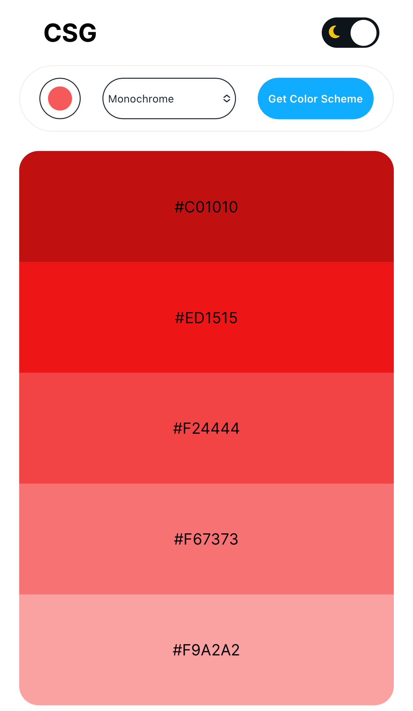
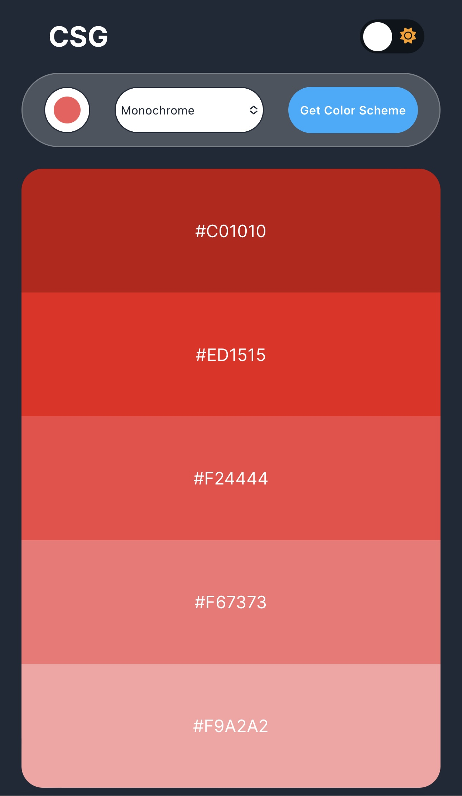

## Scrimba project - Frontend Developer Career Path

### Project: Color Scheme Generator
- A Web app that uses the color api and generates a color scheme based on selected seed color.
- App allows you to click on the hex code provided for each color and copy to clipboard.
- Function for light and dark mode.

### Light Mode

### Dark Mode

